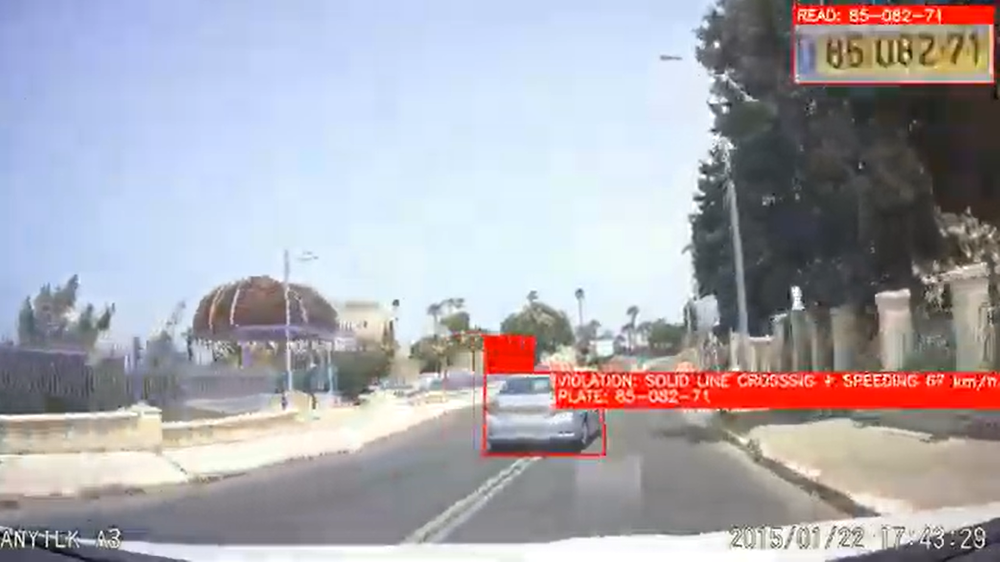
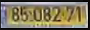

# Road Guard

Road Guard is a dashcam-based traffic violation detection system for Israeli roads. A driver records footage with an Android app; a computer-vision pipeline automatically detects violations committed by other vehicles; a human authority reviewer approves or dismisses each finding via a web dashboard before any action is taken.

---

## Table of Contents

1. [System Overview](#system-overview)
2. [Architecture](#architecture)
3. [Components](#components)
4. [Violation Types](#violation-types)
5. [Custom-Trained Models](#custom-trained-models)
6. [Setup & Running](#setup--running)
7. [Tests](#tests)
8. [Further Reading](#further-reading)

---

## System Overview

The system is built around a **Human-in-the-Loop** design: the pipeline surfaces potential violations and a qualified reviewer always makes the final call. This means a false positive reaching the dashboard is far less harmful than a real violation being silently dropped — the pipeline is tuned for high recall, and the human filters the noise.
Road-Guard is a human in the loop (HITL) automated traffic violation detection system that integrates android dashcam devices,
a cloud based processing pipeline and a web authority dashboard to detect,surface and enforce traffic violations.
---

## Architecture

```
┌─────────────────┐          direct upload        ┌──────────────────┐
│   Android App   │ ──────────────────────────►  │  Cloudflare R2   │
│  (dashcam rec.) │                               │  (raw video +    │
└────────┬────────┘                               │   sensor CSVs)   │
         │ POST /upload/init                      └────────┬─────────┘
         │ POST /upload/complete                           │ download
         ▼                                                 ▼
┌─────────────────┐   GET /internal/next-job   ┌──────────────────┐
│  Node Backend   │ ◄─────────────────────────  │   GPU Worker     │
│ (Express + Mongo│   POST /internal/violation  │  (worker.py)     │
│  + Cloudflare)  │ ◄─────────────────────────  └────────┬─────────┘
└────────┬────────┘                                      │ runs
         │ REST API                              ┌────────▼─────────┐
         ▼                                       │   CV Pipeline    │
┌─────────────────┐                              │  (main.py)       │
│ Authority        │                              │  YOLO + OpenCV + │
│ Dashboard        │                              │  FastALPR        │
│ (React)         │                              └──────────────────┘
└─────────────────┘
```

---

## Components

### Android App (`application/`)
Kotlin app that records 1080p@30fps dashcam video while logging six synchronized sensor streams: gyroscope, GPS, gravity, linear acceleration, and camera intrinsics. After a drive, the user uploads the session directly to Cloudflare R2.
> Stack: Kotlin, CameraX 1.4.0, OkHttp, Google Play Services Location, Android API 26+

### Backend (`backend/`)
REST API that manages users, drives, and violations. Coordinates the upload flow (validates the 7-file session contract), exposes a job queue for the GPU worker, and serves the authority dashboard.
> Stack: Node.js, Express 4, MongoDB (Mongoose), Cloudflare R2, JWT auth

### GPU Worker (`worker.py`)
Runs on the GPU machine. Polls the backend every 5 seconds for queued drives, downloads the session files from R2, runs the full CV pipeline, uploads evidence clips back to R2, and reports violations to the backend. The YOLO model is loaded once and reused across all jobs.

### CV Pipeline (`main.py`, `Objects/`, `violations/`, `speed_estimation/`, `lpr/`)
The core of the system. Processes each video frame with two YOLO models (vehicle tracking + lane segmentation), detects violations, reads license plates, and assembles a ranked evidence bundle (annotated clips, vehicle photos, plate crops, `.docx` reports).
> Stack: Python 3.10, PyTorch + CUDA, Ultralytics YOLOv8/v11, OpenCV, FastALPR, SciPy, boto3

### Authority Dashboard (`frontend/roadguard-authority/`)
Web dashboard where authority reviewers watch violation clips (streamed directly from R2), view vehicle photos and plate reads, and verify or dismiss each finding.
> Stack: React 19, React Router v7, Tailwind CSS, Vite

---

## Violation Types

### Solid-Line Crossing
Detected when a vehicle's tracked bounding box crosses a solid lane marking. Uses a ghost-mask tracker to handle occlusion, a motion direction filter to suppress false positives from oncoming traffic, and a K-of-M temporal gate before a crossing is confirmed.

### Speeding
Reconstructed from pinhole camera geometry combined with ego-motion estimates from the Android sensor streams (gyroscope + GPS + gravity). A Kalman smoother filters the velocity estimate, which is then compared against the speed limit retrieved from the OpenStreetMap Overpass API.

#### how it looks inside the brain :



### Yellow-Line / Shoulder Driving
Detected when a vehicle drives on the wrong side of a yellow lane boundary (shoulder or oncoming lane). Uses a two-sigmoid confidence scorer and an Israeli-road prior (yellow markings appear only on the far-right edge or median).

---

## Custom-Trained Models

Three models in this project were trained from scratch on custom datasets. See [`WEIGHTS.md`](WEIGHTS.md) for download instructions.

| Model file | What it detects | Used for |
|---|---|---|
| `israeli_plates.pt` | Israeli license plates | Feeding crops into FastALPR for plate reading |
| `weights/phase3_v3_yellowprotect.pt` | Lane markings (`solid`, `dashed`, `yellow`) | Solid-line and yellow-line violation detection |
| `models/tire_yolo11n.pt` | Vehicle tires | Stage-2 cascade: confirms solid-line crossings by detecting tires crossing the line |

The general vehicle tracker (`yolo11x.pt`) is an off-the-shelf Ultralytics model, auto-downloaded on first run.


---

## Setup & Running

### Python Pipeline

**Prerequisites:** Python 3.10, CUDA-capable GPU.

```bash
pip install -r requirements.txt
```

> Follow the numbered install steps inside `requirements.txt` — PyTorch with CUDA must be installed manually before the rest.

```bash
# Start the worker — polls the backend and processes drives automatically
python worker.py
```


### Backend

**Prerequisites:** Node.js 18+, MongoDB instance, Cloudflare R2 bucket.

```bash
cd backend
npm install
cp .env.example .env   # fill in Mongo URI, R2 credentials, JWT secret
npm run dev            # development (nodemon)
node server.js         # production
```

### Frontend

**Prerequisites:** Node.js 18+, backend running.

```bash
cd frontend/roadguard-authority
npm install
npm run dev
```

### Android App

Open `application/` in Android Studio. Update `BASE_URL` in `PostDriveActivity.kt` to point to your backend. Build and deploy via Gradle (`assembleDebug` or `assembleRelease`). Requires Android API 26+.


---

## Further Reading

| Document | Contents |
|---|---|
| [`BRAIN_ARCHITECTURE.md`](BRAIN_ARCHITECTURE.md) | Stage-by-stage walkthrough of the CV pipeline: models, detection logic, output files, CLI flags |
| [`docs/ROADGUARD_OVERVIEW.md`](docs/ROADGUARD_OVERVIEW.md) | Full design document: philosophy, building blocks, lessons learned, results, roadmap |
| [`BRAIN_BACKEND_INTEGRATION_HANDOFF.txt`](BRAIN_BACKEND_INTEGRATION_HANDOFF.txt) | Integration contract: bundle structure, API contract, DB schema, upload flow |
| [`WEIGHTS.md`](WEIGHTS.md) | Model weight download guide |
